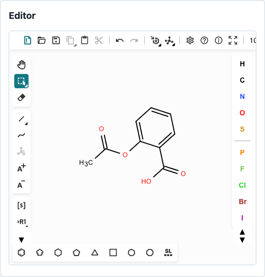
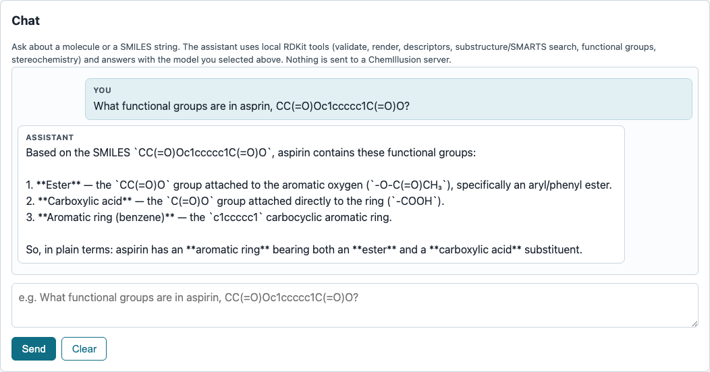
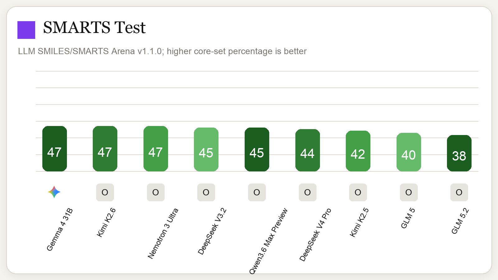

# Clawd Science <small>powered by OpenMolClaw</small>

**An open, local-first chemistry agent harness for Ketcher, RDKit, and
model-driven skills — from the team behind
[ChemIllusion](https://chemillusion.com).**

OpenMolClaw runs the chemistry workspace on your own machine and lets you choose
the model endpoint explicitly. Draw or paste a molecule in Ketcher, validate and
canonicalize it with RDKit, render an SVG, and drive chemistry tools through a
router-first agent loop — no ChemIllusion account or hosted service required.

> Chemistry agents with explicit model routing, running from your own machine.

## About

OpenMolClaw is built and maintained by the team behind
[ChemIllusion](https://chemillusion.com), a hosted chemistry-visualization
and teaching platform. OpenMolClaw is the open, local-first core: local RDKit
chemistry plus an explicit provider interface for the model you choose. See
[what the hosted product adds](docs/hosted.md).

## Why not just use Claude Science?

Claude Science is exciting because it provides a universal science AI workbench.
OpenMolClaw is for chemists who want an inspectable, local-first
chemistry-agent harness, with the option of routing to locally hosted or
OpenRouter-hosted open-weight models.

## Screenshots

The local editor embeds Ketcher and uses RDKit-backed structure handling.



The chat example below was run against OpenRouter with `z-ai/glm-5.2`
(GLM 5.2), using the prototype aspirin functional-groups prompt.



## What's inside

- **Local Flask + simple JS UI** with an embedded Ketcher editor, a
  conversational chat panel, a tool panel, an object list, and a rendered
  workspace preview.
- **Conversational chat** (`POST /api/chat`): ask a question in plain language
  and the harness routes it to the right local tool, runs it, and writes the
  reply with the model you chose — no structure ever leaves your machine for a
  ChemIllusion server.
- **RDKit-backed chemistry tools**: validate, canonicalize, convert, render
  SVGs, molecular descriptors, substructure/SMARTS search, functional-group
  detection, InChI/InChIKey, and stereochemistry.
- **Router-first agent harness**: user request → router → forced tool choice →
  executor → responder reply, with JSON-schema validation and a full execution
  trace. No arbitrary model text is ever executed directly.
- **Filesystem skill system** with schemas, examples, and local tests.
- **Workspace JSON** with semantic aliases (`[m1]`, `[r1]`, `[label1]`) — import
  and export your local workspace as a single JSON file, no database required.
- **Explicit model providers**: local inference, OpenRouter-compatible endpoints,
  and user-supplied chat-completions endpoints. OpenRouter ZDR endpoints are the
  recommended hosted path when you want reduced retention/training risk.
- **Optional rdkit-agent deferred tools**: OpenMolClaw can advertise selected
  [`rdkit-agent`](https://github.com/scottmreed/rdkit-agent) workflows to the
  LLM as standard tool-call options, including similarity search, atom mapping,
  reaction balance checks, and fingerprints. OpenMolClaw does not execute the
  CLI directly; it prepares structured external invocation payloads for agents
  or runtimes that have `rdkit-agent` installed. Enabled by default; disable
  with `tools.rdkit_agent_deferred: false` in config.

## Quick start

```bash
pip install openmolclaw
python -m openmolclaw doctor          # environment + contract self-check
python -m openmolclaw list-tools      # the built-in chemistry tools
python -m openmolclaw run-contracts   # the public-API contract suite (offline)
python -m openmolclaw serve           # local Flask app + Ketcher bridge
python -m openmolclaw install-ketcher --archive /path/to/ketcher-standalone.zip
```

From a source checkout (the package uses a `src/openmolclaw` layout):

```bash
pip install -e ".[dev]"          # editable + tests
pip install -e ".[dev,build]"    # + build/twine for packaging
pytest -q                        # full offline suite
```

Point your browser at the local URL, select a model, draw a molecule, and ask
the agent to validate and render it — or just talk to it in the **Chat** panel
(see [`docs/chat.md`](docs/chat.md)). See [`docs/local_install.md`](docs/local_install.md),
[`docs/model_providers.md`](docs/model_providers.md),
[`docs/api_contracts.md`](docs/api_contracts.md), and
[`docs/publishing.md`](docs/publishing.md).

## Remote, HPC, and Modal runners

OpenMolClaw can also run from remote compute environments while keeping the
same explicit model-provider configuration: cloud VMs over SSH tunnels,
lightweight HPC login-node diagnostics, Slurm compute-node jobs, and Modal WSGI
deployments. See [`docs/running_remote.md`](docs/running_remote.md) for runner
templates, SSH tunnel commands, Modal deployment, and remote exposure warnings.

## Model providers

The primary hosted path is OpenRouter with ZDR routing enabled:

```yaml
model:
  provider: openrouter
  model: google/gemma-4-26b-a4b-it
  base_url: https://openrouter.ai/api/v1
  zdr: true
```

OpenRouter ZDR routes requests to endpoints marked zero-data-retention. The
endpoint still processes your request to generate a response, but the ZDR path
is designed to prevent prompt retention and training on supported endpoints.

### Optional OpenRouter ZDR Mode

OpenMolClaw is local-first: it does not send your structures to ChemIllusion
servers and does not require a ChemIllusion account. If you choose OpenRouter as
your model provider, you can enable **ZDR (Zero Data Retention) Mode** so
OpenMolClaw adds per-request routing controls requiring Zero Data Retention
endpoints, denying provider data collection, and disabling provider fallbacks.
Local workspace files are still stored on your own machine unless you enable
memory-only workspace mode. Inspect the resolved posture any time with
`python -m openmolclaw privacy` or `GET /api/privacy`. Full details,
limitations, and env overrides are in [`docs/zdr.md`](docs/zdr.md).

### Private Structure Mode (strongest claim)

A single toggle — `model.privacy.private_structure_mode`, the Privacy panel
checkbox, or `OPENMOLCLAW_PRIVATE_STRUCTURE_MODE=1` — combines ZDR-compatible
AI routing (when a hosted provider is used), blocked external molecule
lookups, and a memory-only workspace with no silent weakening of any of the
three. When all three actually hold, `/api/privacy` reports:

> Private Structure Mode: structures are processed only for the active
> request, routed through ZDR-compatible AI providers where AI is required,
> excluded from model training, excluded from external molecule lookups, and
> not saved to projects or chat history unless you explicitly choose to save
> them.

The claim is withheld for a custom (non-`local`, non-`openrouter`) endpoint,
since OpenMolClaw cannot verify an arbitrary endpoint's retention policy. See
[`docs/zdr.md`](docs/zdr.md#private-structure-mode) for exactly what each
clause depends on.

A fully local endpoint also works:

```yaml
model:
  provider: local
  model: olmo
  endpoint: http://localhost:11434/v1
```

The provider layer is an interface (`ModelProvider`), so you can point it at any
model through a local, OpenRouter, or explicit chat-completions-compatible
endpoint. Provider selection is always **explicit and fail-closed**: OpenMolClaw
never guesses a vendor endpoint and never silently falls back to another model.
See [`docs/model_providers.md`](docs/model_providers.md).

### Choosing open source models for chemistry notation

OpenMolClaw can run against local and open source models, but chemistry tasks
are especially sensitive to whether the model preserves chemical line notation
such as SMILES, SMARTS, and InChI. The
[LLM Smarts Arena benchmark](https://github.com/scottmreed/llm-smarts-arena)
tracks how candidate open source models perform on notation-heavy chemistry
prompts, making it a practical starting point when choosing a model for local
OpenMolClaw use.



Use the benchmark results as a filter before testing a model in your own
workflow: prefer models that reliably parse, preserve, and reason over chemical
line notation, then validate them against the specific structures and prompts
you plan to use.

## Repository layout

Synced vs public-owned files: [`docs/sync_policy.md`](docs/sync_policy.md).

## Running locally

```bash
git clone https://github.com/scottmreed/openmolclaw.git
cd openmolclaw
pip install -e ".[dev]"          # editable install + tests
python -m openmolclaw doctor     # environment + contract self-check
python -m openmolclaw serve      # http://127.0.0.1:5000
```

No API key is required to install, run `doctor`, run the test suite, or use
the local chemistry tools and workspace. A key is only needed if you point the
agent loop at a hosted model provider (a fully local model endpoint, e.g.
Ollama, also needs no key). See [`docs/local_install.md`](docs/local_install.md)
for the full setup, CLI reference, and test commands.

## Adding API keys

Set provider keys as environment variables — never in a config file or commit:

```bash
export OPENROUTER_API_KEY=...        # recommended hosted path (ZDR Mode)
```

Then point your config at the provider:

```yaml
model:
  provider: openrouter
  model: google/gemma-4-26b-a4b-it
  base_url: https://openrouter.ai/api/v1
  privacy:
    openrouter_zdr: true
    deny_data_collection: true
    allow_fallbacks: false
```

For any other chat-completions-compatible gateway that follows the same request
shape, set `provider`, `endpoint`, and `api_key_env` explicitly in the config —
OpenMolClaw never guesses a vendor endpoint or silently falls back to another
provider. Load the config with
`OPENMOLCLAW_CONFIG=/path/to/config.yaml` or pass `--config` to `doctor`. Full
details, the full env var table, and fail-closed behavior are in
[`docs/model_providers.md`](docs/model_providers.md).

## Contributing

See [**CONTRIBUTING.md**](CONTRIBUTING.md) for the full guide, including the
[**sync policy**](docs/sync_policy.md) (public-owned vs synced-from-private
files), issue templates, and discussion categories.

- Public-owned files: open a PR as usual.
- Synced files (generated header present): open a PR as a patch proposal — a
  maintainer will import accepted changes upstream and re-export.
- New skills are welcome as public-owned skills — use the **New chemistry skill**
  issue template or open a PR per [`docs/adding_skills.md`](docs/adding_skills.md).

## License

[Apache-2.0](LICENSE). OpenMolClaw is © the ChemIllusion team; see the `NOTICE`
handling in `LICENSE` and the attribution above.
